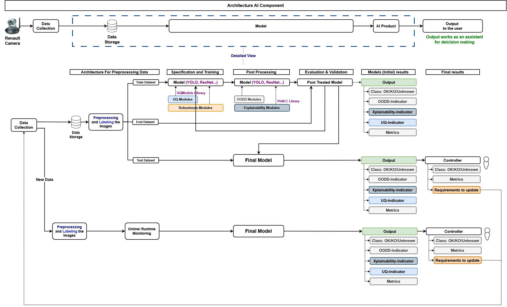

# AI Component Architecture

### Overview
This architecture enables the automated detection of surface welding defects using images captured by a Renault camera. It supports model development, evaluation, and continuous deployment through a modular and iterative AI pipeline. Key focus areas include robustness, explainability, and user trust.

The architecture is composed of mainly three parts: 

    (i) The Data collection part with the Renault Camera and the creation of the database with the photos taken. 
    
    (ii) This first part is followed by a pipeline consisting on the Data processing and the AI Model/Product. 
    
    (iii) Finally, the output of the component that the user could use as an assistant for decision making. 

#### Techniques that could be used

Images are first collected using the Renault camera, then labeled and preprocessed to train a model for detecting the welding quality. This process could be done by using different models for this case we could test two main models: YOLO (You Only Look Once) and the Faster R-CNN. For the Robustness modules we could use AIMOS, or Adversial attacks by pertubating the images. For the Xplainability we could use Lime or PUNCC. To quantify the uncertainity also we could use the UQModels Library. 

#### Architecture Description

In this architecture, we begin by building a sufficiently large image database to train the model effectively. The images are then labeled and preprocessed, which includes resizing, normalization, and optional enhancements such as contrast improvement and noise reduction. Additionally, data augmentation techniques may be applied to increase variability and improve the model’s robustness. The dataset is splitted into three parts Train, Evaluation and Test. 

The training dataset is used to train the model, which incorporates Uncertainty Quantification (UQ) and robustness modules to improve performance and reliability. Once training is complete, post-processing is performed using Out-of-Distribution Detection (OODD) techniques and explainability methods to interpret the model's decisions and build user trust.  

The trained model is evaluated using various performance metrics, including F1-score, false positive rate, and recall, and is designed to be iteratively improved to enhance its performance. In addition to these metrics, complementary indicators such as the Uncertainty Quantification (UQ) indicator, Explainability indicator, and Out-of-Distribution Detection (OODD) indicator are also computed to provide a comprehensive assessment of the model’s reliability and transparency. Finally, the evaluated model is applied to a separate test dataset to validate its performance and assess its generalization capabilities under real-world conditions

### Deeper Dive into the Architecture

#### Data Collection and Storage

- **Input Source**: High-resolution images are captured using a Renault industrial camera.
- **Storage**: Images are saved in a centralized data storage system, which serves as the input for both training and monitoring workflows.

#### Preprocessing and Labeling

The collected images undergo a series of preprocessing steps to standardize and enhance the data:

- **Labeling**: Images are annotated with labels (e.g., OK, KO), and segmented using (LabelStudio or a similar softwar).
- **Preprocessing Techniques**:
  - **Resizing** to a consistent input size suitable for the model.
  - **Normalization** of pixel values to ensure consistent input distributions.
  - **Enhancement** : Contrast enhancement, noise reduction, and sharpening to highlight defects.
  - **Data Augmentation** : Rotations, flips, brightness variation, and other transformations to improve generalization.

The dataset is split into:
- **Training Dataset**: For training the model.
- **Evaluation Dataset**: For interim performance checks.
- **Test Dataset**: For final performance validation.

#### Model Specification and Training

- **Model Types**: The architecture supports modular plug-in models such as **YOLO**, **ResNet**, or **Faster R-CNN** and others suited to image classification or object detection.
- **Training Enhancements**:
  - **UQ Modules (Uncertainty Quantification)**: To estimate prediction confidence and reliability.
  - **Robustness Modules**: To improve model resilience to noise, lighting changes, and other real-world variabilities.
  - These modules are integrated using dedicated libraries (e.g., `UQModels library`).

#### Post-Processing

After initial training, the model is post-processed with advanced diagnostic modules:

- **Explainability Modules**: Used to interpret predictions through techniques like Grad-CAM or SHAP.
- **OODD Modules (Out-of-Distribution Detection)**: Detect whether input data significantly deviates from training data distribution.
- **PUNCC Library**: Likely used for calibration and refinement of uncertainty estimation.

#### Evaluation and Validation

The post-treated model is evaluated using both standard and advanced metrics:

- **Performance Metrics**:
  - F1-score
  - False Positive Rate
  - Recall
- **Additional Indicators**:
  - **UQ Indicator**: Measures confidence and calibration.
  - **Explainability Indicator**: Assesses model interpretability and decision transparency.
  - **OODD Indicator**: Evaluates how well the model detects unfamiliar data.

The model is iteratively updated based on these indicators.

#### Deployment and Final Model Integration

The validated model is finalized and deployed for live inference:

- **Outputs**:
  - Classification: OK / KO / Unknown
  - UQ, OODD, and Explainability indicators
  - Summary metrics
- **Controller Module**:
  - Interprets the outputs
  - Monitors performance trends
  - Triggers update requirements when needed

#### Online Runtime Monitoring and Feedback Loop

For the new collected data we preprocess the images in the same way as the stored images.
- **New Data Ingestion**: Continuous collection of new welding images.
- **Live Preprocessing and Inference**: Incoming images are preprocessed and passed through the deployed model.
- **Monitoring Outputs**: Real-time analysis includes all standard and advanced indicators.
- **Controller Actions**: Based on monitored results, the system can:
  - Signal for model updates
  - Support quality assurance personnel with actionable insights

